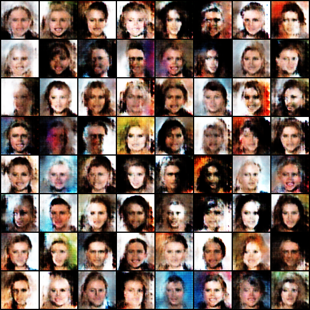
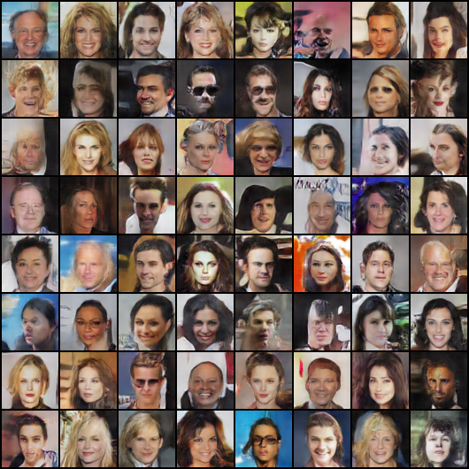
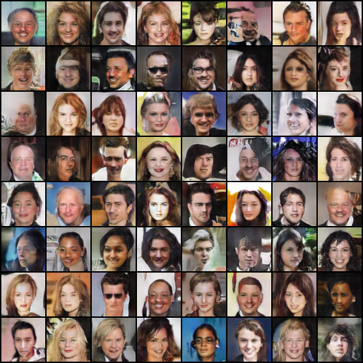

# GAN face morphing: DCGAN latent-space video, restored and smoothed to 60 fps

I trained a **DCGAN** from scratch on CelebA faces and turned a walk through its latent space into a smooth face-morphing video, then improved it with face restoration (GFPGAN) and frame interpolation (RIFE).

https://github.com/EvansDesikan/GenAI_Face_Morphing/raw/main/face_morphing_60fps.mp4

## Pipeline

| Step | Script | What it does |
| --- | --- | --- |
| 1. Train | `train_gan.py` | DCGAN (generator + discriminator, PyTorch), 64 x 64 images, latent size 100, 25 epochs, batch 128, Adam (lr 0.0002, beta1 0.5) |
| 2. Generate | `generate_video.py` | Spherical interpolation (slerp) between random latent keyframes every 2 s; 15 s at 30 fps, upscaled to 720 x 720 |
| 3. Restore | `upscale_video.py` | Cleans each face with GFPGAN v1.3 |
| 4. Smooth | `smooth_video_exe.py` | Doubles the frame rate to 60 fps with RIFE v4.6 frame interpolation |

Training progress (one sample grid per epoch): `output_epoch_0.png` to `output_epoch_24.png`.

| Epoch 0 | Epoch 12 | Epoch 24 |
| :---: | :---: | :---: |
|  |  |  |

## Run it

```bash
python3 -m venv .venv && source .venv/bin/activate
pip install -r requirements.txt

# CelebA images in "dataset Celeb/<any subfolder>/" (ImageFolder layout)
python train_gan.py          # saves generator_final.pth
python generate_video.py     # face_morphing_720p.mp4
python upscale_video.py      # face_morphing_HD_AI.mp4 (GFPGAN weights download automatically)

# Frame interpolation: download rife-ncnn-vulkan from
# https://github.com/nihui/rife-ncnn-vulkan/releases and place the executable and the rife-v4.6 model folder here
python smooth_video_exe.py   # face_morphing_60fps.mp4
```

## Credits

- [RIFE](https://github.com/hzwer/arXiv2020-RIFE) by Huang et al., run through [rife-ncnn-vulkan](https://github.com/nihui/rife-ncnn-vulkan) (MIT) by nihui.
- [GFPGAN](https://github.com/TencentARC/GFPGAN) by Tencent ARC.
- DCGAN architecture after Radford et al. (2015); CelebA dataset by Liu et al.

My work: the DCGAN training, latent-space video generation and the processing pipeline that connects the tools.
